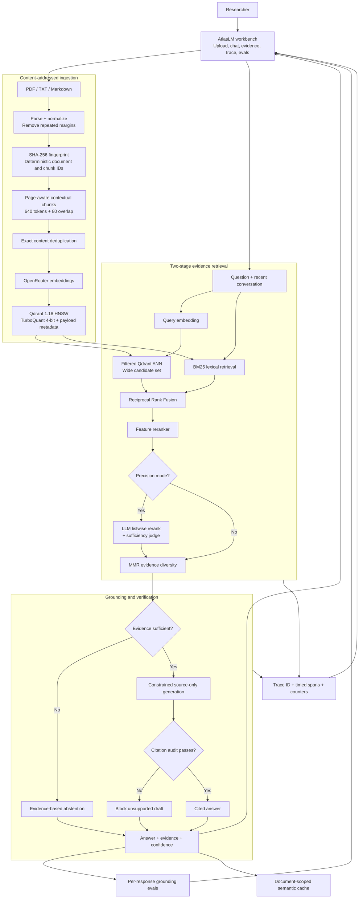
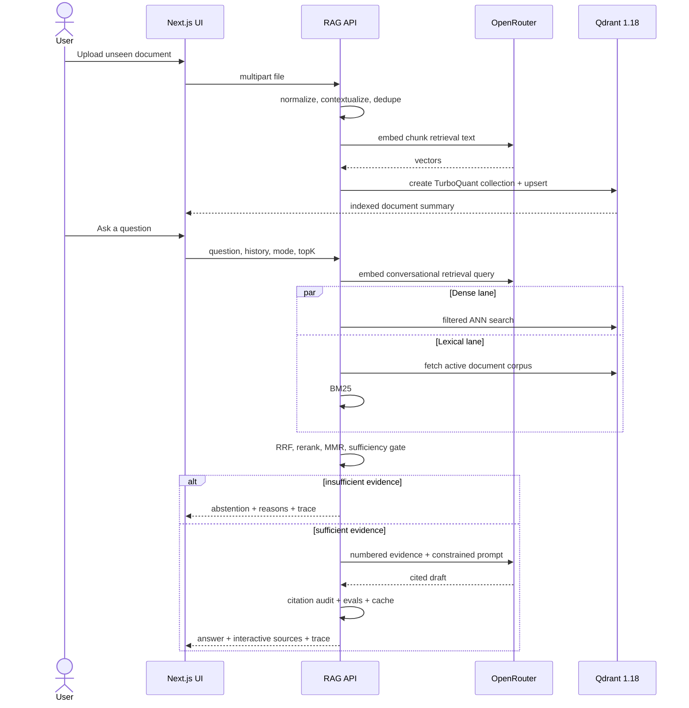
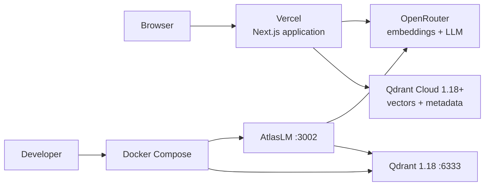

# AtlasLM High-Level Design

## End-To-End Flow

```mermaid
flowchart TB
    User["Researcher"] --> UI["AtlasLM workbench<br/>Upload, chat, evidence, trace, evals"]

    subgraph Ingestion["Content-addressed ingestion"]
        Upload["PDF / TXT / Markdown"] --> Normalize["Parse + normalize<br/>Remove repeated margins"]
        Normalize --> Identity["SHA-256 fingerprint<br/>Deterministic document and chunk IDs"]
        Identity --> Chunk["Page-aware contextual chunks<br/>640 tokens + 80 overlap"]
        Chunk --> Dedupe["Exact content deduplication"]
        Dedupe --> EmbedDoc["OpenRouter embeddings"]
        EmbedDoc --> VectorDB["Qdrant 1.18 HNSW<br/>TurboQuant 4-bit + payload metadata"]
    end

    UI --> Upload

    subgraph Retrieval["Two-stage evidence retrieval"]
        Question["Question + recent conversation"] --> EmbedQuery["Query embedding"]
        EmbedQuery --> ANN["Filtered Qdrant ANN<br/>Wide candidate set"]
        Question --> BM25["BM25 lexical retrieval"]
        ANN --> RRF["Reciprocal Rank Fusion"]
        BM25 --> RRF
        RRF --> Feature["Feature reranker"]
        Feature --> Precision{"Precision mode?"}
        Precision -->|"Yes"| Listwise["LLM listwise rerank<br/>+ sufficiency judge"]
        Precision -->|"No"| MMR["MMR evidence diversity"]
        Listwise --> MMR
    end

    UI --> Question
    VectorDB --> ANN
    VectorDB --> BM25

    subgraph Grounding["Grounding and verification"]
        MMR --> Gate{"Evidence sufficient?"}
        Gate -->|"No"| Abstain["Evidence-based abstention"]
        Gate -->|"Yes"| Generate["Constrained source-only generation"]
        Generate --> Audit{"Citation audit passes?"}
        Audit -->|"No"| Block["Block unsupported draft"]
        Audit -->|"Yes"| Answer["Cited answer"]
        Abstain --> Result["Answer + evidence + confidence"]
        Block --> Result
        Answer --> Result
    end

    Result --> UI
    Result --> Eval["Per-response grounding evals"]
    Result --> Cache["Document-scoped semantic cache"]
    Retrieval --> Trace["Trace ID + timed spans + counters"]
    Grounding --> Trace
    Eval --> UI
    Trace --> UI
```

## Request Sequence

```mermaid
sequenceDiagram
    actor User
    participant UI as Next.js UI
    participant API as RAG API
    participant OR as OpenRouter
    participant Q as Qdrant 1.18

    User->>UI: Upload unseen document
    UI->>API: multipart file
    API->>API: normalize, contextualize, dedupe
    API->>OR: embed chunk retrieval text
    OR-->>API: vectors
    API->>Q: create TurboQuant collection + upsert
    Q-->>UI: indexed document summary

    User->>UI: Ask a question
    UI->>API: question, history, mode, topK
    API->>OR: embed conversational retrieval query
    par Dense lane
        API->>Q: filtered ANN search
    and Lexical lane
        API->>Q: fetch active document corpus
        API->>API: BM25
    end
    API->>API: RRF, rerank, MMR, sufficiency gate
    alt insufficient evidence
        API-->>UI: abstention + reasons + trace
    else sufficient evidence
        API->>OR: numbered evidence + constrained prompt
        OR-->>API: cited draft
        API->>API: citation audit + evals + cache
        API-->>UI: answer + interactive sources + trace
    end
```

## Deployment Topology

```mermaid
flowchart LR
    Browser["Browser"] --> Vercel["Vercel<br/>Next.js application"]
    Vercel --> OpenRouter["OpenRouter<br/>embeddings + LLM"]
    Vercel --> QCloud["Qdrant Cloud 1.18+<br/>vectors + metadata"]

    Developer["Developer"] --> Docker["Docker Compose"]
    Docker --> LocalApp["AtlasLM :3002"]
    Docker --> LocalQ["Qdrant 1.18 :6333"]
    LocalApp --> OpenRouter
    LocalApp --> LocalQ
```
