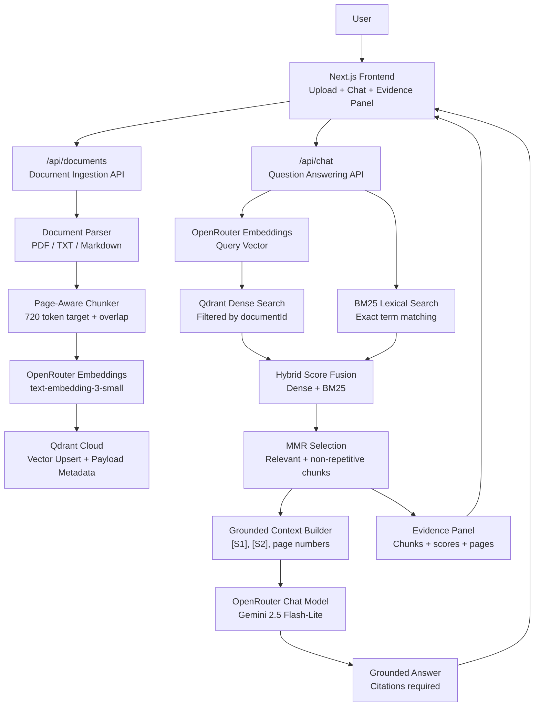
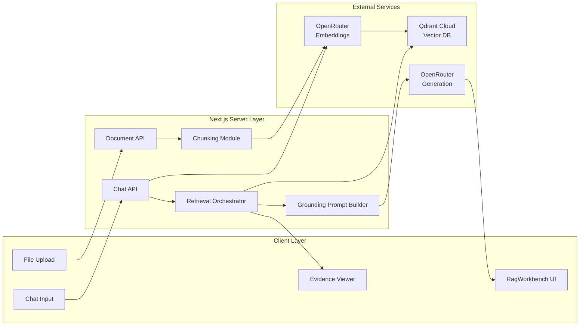
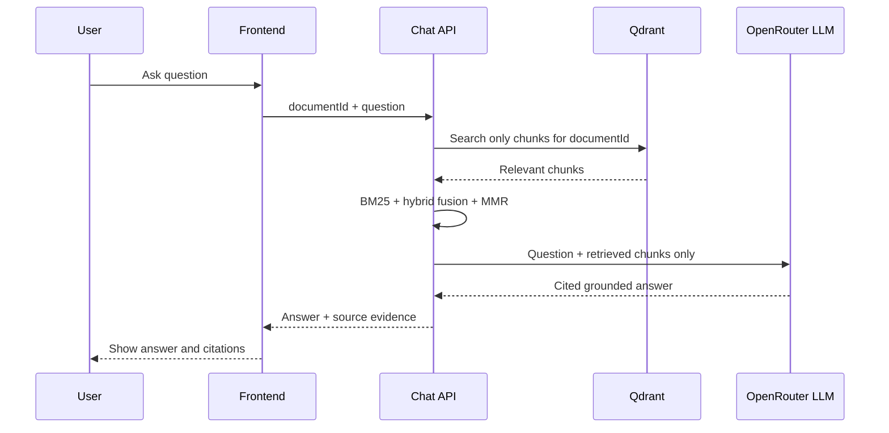

# AtlasLM HLD Diagram

## Overall System Flow

## Component View

## Request Flow

1. User uploads a PDF, TXT, or Markdown document.
2. The document ingestion API extracts readable text.
3. The chunker splits text into page-aware overlapping chunks.
4. Each chunk is embedded using OpenRouter embeddings.
5. Chunks and metadata are stored in Qdrant Cloud.
6. User asks a natural language question.
7. The question is embedded.
8. Qdrant retrieves semantically similar chunks.
9. BM25 scores exact keyword relevance across document chunks.
10. Hybrid fusion combines semantic and lexical relevance.
11. MMR selects the most useful non-repetitive chunks.
12. The LLM receives only retrieved source context.
13. The answer is returned with citations like `[S1]`.
14. The UI shows source chunks, page numbers, and retrieval scores.

## Grounding Boundary

The main grounding rule is that the LLM never receives the whole internet or a general prompt alone. It receives the user question plus selected chunks from the uploaded document, and the prompt requires citation-backed answers.

